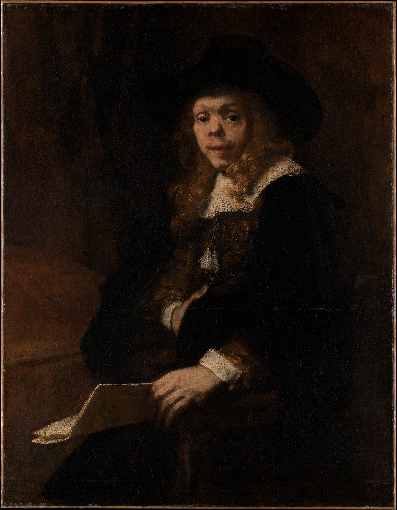
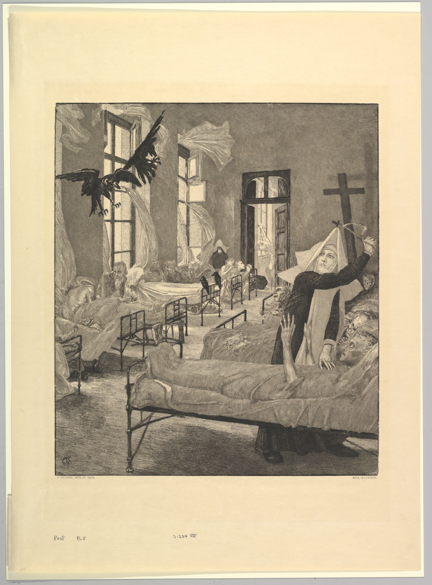

# Assets

## Artwork

  [German 15th Century, Saint Sebastian, 1440/1460](https://www.nga.gov/collection/art-object-page.3843.html)

  [Portrait of Gerard de Lairesse, Rembrandt (Rembrandt van Rijn) Dutch, 1665–67](https://www.metmuseum.org/art/collection/search/459082)

 [See](https://www.metmuseum.org/art/collection/search/384484)